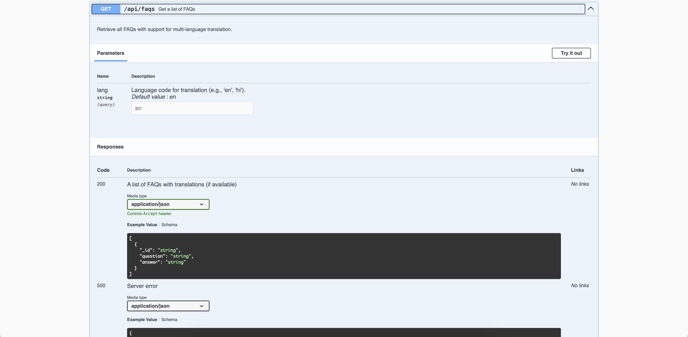
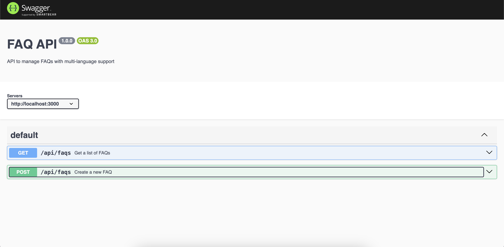
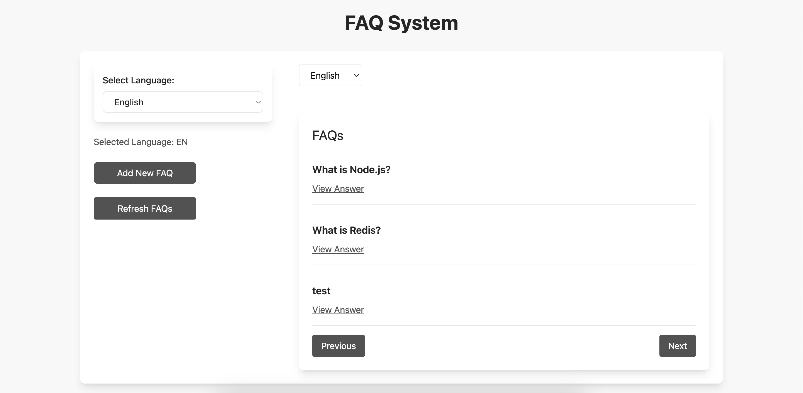

# FAQ Management System - Frontend

This repository implements the frontend for the FAQ management system using **React** and **Vite**. The system interacts with the backend to fetch FAQs in different languages, leveraging **Redis** caching and an external **translation API** for multilingual support.

**Backend Repository**: [FAQ API](https://github.com/Trident14/Faq-Api)

**Key Features**:

- **Language Selection**: Allows users to select the language (default is English) for viewing FAQs.
- **FAQ List**: Displays a list of FAQs with questions and answers.
- **Modal View**: Users can view the detailed answers of FAQs in a modal window.
- **Pagination**: The FAQs are displayed in paginated format, with a defined number of FAQs per page.
- **Fetching from Cache**: The frontend communicates with the backend that utilizes Redis caching for fast retrieval of FAQs.
  

